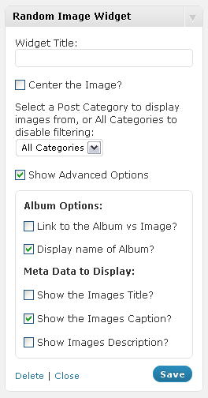

# Random Image Block plugin for WordPress

The Random Image Block is a small [WordPress][1] plugin that will display a random image from your native WordPress photo galley or in-beaded images.

This widget will display the thumbnail of the random image, the .caption. and the images parent posts name. You may show all pictures on your site, or limit the selection to a single category if you wish. The Widgets title is also fully configurable. Random Image Widget was designed with full internationalization in mind and can be fully translated (Any help on this would be appreciated).

As of Version 0.3 this plugin works out of the box with out and configuration (assuming you have pictures on your site).

The Random Image Block plugin works with WordPress 3.0+ in both single and multi site modes. As a Site Admin, you may activate this plugin across all the sites on your install.

If you have any problems or concerns with this plugin, please leave a [comment below][2].

This Plugin is fully translated into the following languages:

*   Arabic
*   Czech
*   Finnish
*   French
*   Danish
*   Dutch
*   German
*   Indonesian
*   Italian
*   Portuguese
*   Russian
*   Spanish

If you would like to help translating this plugin, or you see a problem with the current translation, please [contact me][3].

  
## Download

The Current Version is 0.9.1 released on October 3rd, 2010.

*   [Random Image Block . Version 0.9.1][4]
*   [Random Image Block . Version 0.9][5]
*   [Random Image Block . Version 0.8][6]
*   [Random Image Block . Version 0.7][7]
*   [Random Image Block . Version 0.6][8]
*   [Random Image Block . Version 0.5][9]
*   [Random Image Block . Version 0.4][10]
*   [Random Image Block . Version 0.3][11]
*   [Random Image Block . Version 0.2][12]
*   [Random Image Block . Version 0.1][13]

You can also clone the project with [Git][14] by running: 

    $ git clone git://github.com/mattrude/random-image-block

If your using git, make sure to hit the 

[Random Image Block's github page][15]. 

  
## Screen Shots

  

## Dependencies

[WordPress][1] 2.9+

## Installing

As with most WordPress plugins, there is two ways of installing this plugin.

#### Primary Option

1.  Go to your WordPress Dashboard and login as an Admin
2.  From your Dashboard go to `Plugins` section on the left hand side and select `Add New`.
3.  Search for `Random Image Block`
4.  Click the `Install Now` link and follow the instructions.

#### Backup Option

1.  Download the latest version from the download page ([http://wordpress.org/extend/plugins/random-image-block/](http://wordpress.org/extend/plugins/random-image-block/))
2.  Extract the zip file and copy the folder "random-image-block" into the "wp-content/plugins/" directory in your WordPress installation.
3.  Activate the plugin from your Dashboard by going to Plugins -> Installed page.

## Frequently Asked Questions

### Q: May I have more the one image on my sidebar?

*   Sure, just add a second or third widget to the sidebar, but you can't do it from within this widget.

### Q: May I display more then one category at once?

*   No, you may only display a single category or all categories per widget.

### Q: I have no picture in my sidebar, the widget doesn't work!

*   Make sure the category you have selected has pictures in it, if it doesn't, nothing will be displayed.

### Q: Will this plugin work with WP Super Cache enabled?

*   Unfortunately, no. WP Super Cache caches all php built html pages for quicker page loads. Since the Random Image Block is built directly into the html page, with WP Super Cache enabled, you will see the same random image on the same page until the cache refreshes. Each page will still have a diffrent image, but they will not update. Currently there is no work around.

## Change Log

### Version 0.9.1

*   Fixed bug where default options were always on

### Version 0.9

*   Added Advanced Options
*   Allow for custom Meta data
*   Added Tranlation for: Arabic, Czech, Danish, Dutch, Finnish, Indonesian, & Russian

### Version 0.8

*   Added ability to link to the album vs the image.

### Version 0.7

*   Changed to dropdown box for category selection, translaion files have not been fully updated, yet.

### Version 0.6

*   Added ability to center image in the wiget area

### Version 0.5

*   Switched to '{$before\_widget}{$before\_title}'... to try and resolve some display problems

### Version 0.4

*   Translated into: French, German, Italian, Portuguese, & Spanish

### Version 0.3

*   Fixed bug that showed no picture if the category box was left blank.
*   Single Category check box now works.

### Version 0.2

*   Added check box to allow single category.

### Version 0.1

*   Everythings new!

## License

This plugin is licensed under the [GPLv2][16]. A copy of the license also comes with every copy download.

<pre>GNU GENERAL PUBLIC LICENSE
Version 2, June 1991

Copyright (C) 1989, 1991 Free Software Foundation, Inc.
51 Franklin Street, Fifth Floor, Boston, MA  02110-1301, USA

Everyone is permitted to copy and distribute verbatim copies
of this license document, but changing it is not allowed.</pre>

  
## Authors

[Matt Rude][17] m@mattrude.com

 [1]: http://wordpress.org/
 [2]: #idc-container
 [3]: http://mattrude.com/contact-me/
 [4]: http://github.com/downloads/mattrude/random-image-block/random-image-block.0.9.1.zip
 [5]: http://github.com/downloads/mattrude/random-image-block/random-image-block.0.9.zip
 [6]: http://github.com/downloads/mattrude/random-image-block/random-image-block.0.8.zip
 [7]: http://github.com/downloads/mattrude/random-image-block/random-image-block.0.7.zip
 [8]: http://github.com/downloads/mattrude/random-image-block/random-image-block.0.6.zip
 [9]: http://github.com/downloads/mattrude/random-image-block/random-image-block.0.5.zip
 [10]: http://github.com/downloads/mattrude/random-image-block/random-image-block.0.4.zip
 [11]: http://github.com/downloads/mattrude/random-image-block/random-image-block.0.3.zip
 [12]: http://github.com/downloads/mattrude/random-image-block/random-image-block.0.2.zip
 [13]: http://github.com/downloads/mattrude/random-image-block/random-image-block.0.1.zip
 [14]: http://git-scm.com
 [15]: http://github.com/mattrude/random-image-block
 [16]: http://www.gnu.org/licenses/gpl-2.0.html
 [17]: http://github.com/mattrude/
